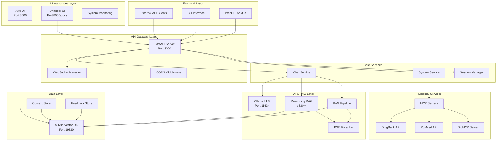
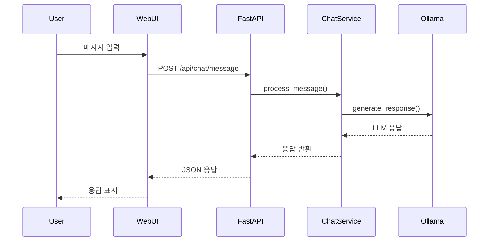
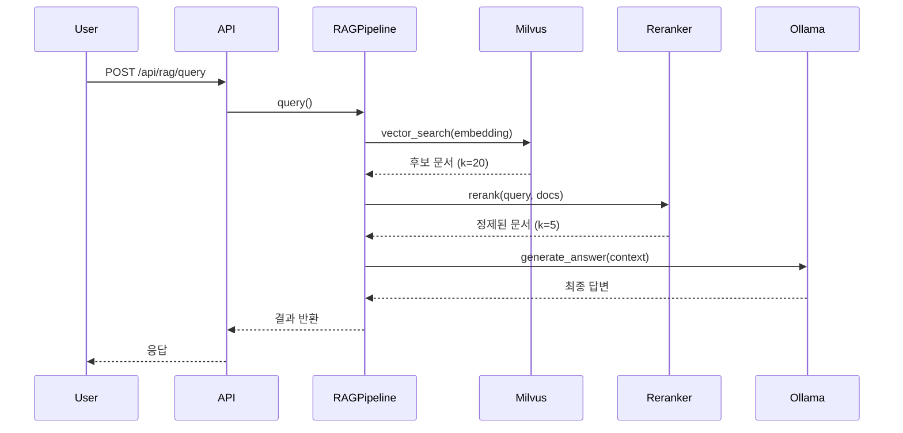
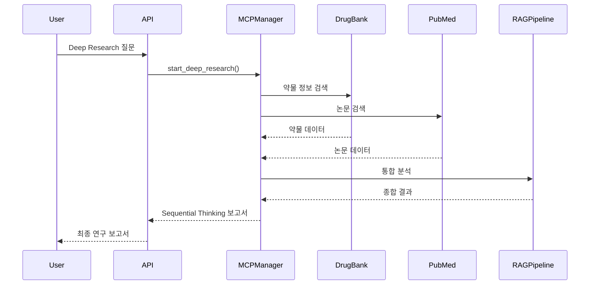
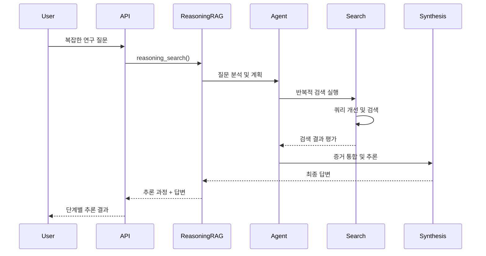
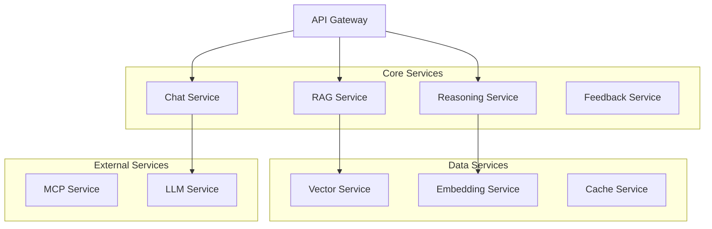

# GAIA-BT System Architecture Documentation v3.84

## 📋 시스템 개요

GAIA-BT는 신약개발 전문 AI 연구 어시스턴트로, 마이크로서비스 아키텍처를 기반으로 한 확장 가능하고 모듈화된 시스템입니다. Ollama LLM, MCP(Model Context Protocol), RAG(Retrieval-Augmented Generation), 그리고 Reasoning RAG 시스템을 통합하여 포괄적인 연구 지원 기능을 제공합니다.

## 🏗️ 전체 시스템 아키텍처



## 🔧 핵심 컴포넌트

### 1. Frontend Layer

#### WebUI (Next.js)
- **포트**: 3003
- **기술**: Next.js 15, TypeScript, Tailwind CSS
- **주요 기능**:
  - 실시간 스트리밍 채팅
  - 모드 전환 (일반 ↔ 딥리서치)
  - 응답 피드백 시스템
  - 반응형 디자인

```typescript
// 핵심 컴포넌트 구조
src/
├── app/              # App Router
├── components/       # React 컴포넌트
│   ├── Chat/        # 채팅 관련
│   ├── UI/          # 공통 UI
│   └── Layout/      # 레이아웃
├── contexts/        # Context API
├── hooks/           # Custom Hooks
└── types/           # TypeScript 타입
```

#### CLI Interface
- **위치**: `app/cli/`
- **기능**: 터미널 기반 인터페이스
- **명령어**: `/help`, `/mcp`, `/normal`, `/prompt`

### 2. API Gateway Layer

#### FastAPI Server
- **포트**: 8000
- **기술**: FastAPI, Python 3.13+
- **기능**:
  - RESTful API 제공
  - WebSocket 지원
  - 자동 API 문서 생성
  - CORS 처리

```python
# 주요 라우터 구조
app/api_server/
├── main.py           # 메인 애플리케이션
├── routers/          # API 라우터
│   ├── chat.py      # 채팅 API
│   ├── system.py    # 시스템 API
│   ├── rag.py       # RAG API
│   ├── feedback.py  # 피드백 API
│   ├── mcp.py       # MCP API
│   └── session.py   # 세션 API
├── services/        # 비즈니스 로직
├── models/          # 데이터 모델
└── websocket_manager.py
```

### 3. Core Services

#### Chat Service
```python
class ChatbotService:
    """메인 챗봇 서비스"""
    
    def __init__(self):
        self.llm_client = OllamaClient()
        self.rag_pipeline = RAGPipeline()
        self.reasoning_rag = ReasoningRAGPipeline()  # v3.84+
        self.mcp_manager = MCPManager()
        
    async def process_message(self, message: str, mode: str):
        if mode == "normal":
            return await self._normal_response(message)
        elif mode == "deep_research":
            return await self._deep_research_response(message)
        elif mode == "reasoning":  # v3.84+
            return await self._reasoning_response(message)
```

#### System Service
- **모델 관리**: Ollama 모델 시작/중지/전환
- **설정 관리**: 프롬프트, 모드, 디버그 설정
- **상태 모니터링**: 시스템 헬스체크

#### Session Manager
- **세션 생성/삭제**: 사용자 세션 관리
- **상태 유지**: 대화 컨텍스트 보관
- **메타데이터 관리**: 세션별 설정

### 4. AI & RAG Layer

#### Ollama LLM Integration
```python
# Ollama 클라이언트 설정
OLLAMA_CONFIG = {
    "base_url": "http://localhost:11434",
    "models": {
        "main": "gemma3-12b",
        "embedding": "mxbai-embed-large",
        "fast": "gemma3-8b"
    },
    "options": {
        "temperature": 0.7,
        "top_p": 0.9,
        "max_tokens": 4096
    }
}
```

#### RAG Pipeline (v3.77)
```python
class RAGPipeline:
    """2단계 RAG 시스템"""
    
    def __init__(self):
        self.vector_store = MilvusVectorStore()
        self.embedder = MxbaiEmbedder()
        self.reranker = BGEReranker()
        
    async def query(self, query: str, use_reranking: bool = True):
        # 1단계: 벡터 검색
        candidates = await self.vector_store.search(
            embedding=await self.embedder.embed(query),
            top_k=20
        )
        
        # 2단계: Cross Encoder 리랭킹
        if use_reranking:
            candidates = await self.reranker.rerank(
                query=query,
                documents=candidates,
                top_k=5
            )
            
        return candidates
```

#### Reasoning RAG (v3.84+)
```python
class ReasoningRAGPipeline:
    """고급 추론 기반 RAG"""
    
    async def reasoning_search(self, query: str, mode: str):
        if mode == "self_rag":
            return await self._self_rag_pipeline(query)
        elif mode == "cot_rag":
            return await self._cot_rag_pipeline(query)
        elif mode == "mcts_rag":
            return await self._mcts_rag_pipeline(query)
```

### 5. Data Layer

#### Milvus Vector Database
```yaml
# 컬렉션 구조
Collections:
  documents:           # 메인 RAG 문서
    dimension: 512
    index_type: HNSW
    metric_type: IP
    
  feedback_collection: # 사용자 피드백
    dimension: 512
    fields: [question_embedding, answer_embedding, feedback_type]
    
  reasoning_context:   # 추론 컨텍스트 (v3.84+)
    dimension: 512
    fields: [query_embedding, reasoning_type, step_data]
```

#### Vector Store Implementation
```python
class MilvusVectorStore:
    def __init__(self, uri: str = "tcp://localhost:19530"):
        self.client = MilvusClient(uri=uri)
        
    async def add_documents(self, documents: List[Document]):
        """문서 추가"""
        
    async def search(self, embedding: List[float], top_k: int):
        """벡터 검색"""
        
    async def hybrid_search(self, query: str, filters: Dict):
        """하이브리드 검색"""
```

### 6. External Services

#### MCP (Model Context Protocol) Integration
```python
# MCP 서버 구성
MCP_SERVERS = {
    "drugbank": {
        "command": "python -m mcp_drugbank",
        "args": ["--api-key", "${DRUGBANK_API_KEY}"]
    },
    "pubmed": {
        "command": "python -m mcp_pubmed", 
        "args": ["--max-results", "10"]
    },
    "biomcp": {
        "command": "python -m biomcp_server",
        "args": ["--database-path", "./data/bio.db"]
    }
}
```

#### External API Integration
- **DrugBank**: 약물 정보 데이터베이스
- **OpenTargets**: 유전자-질병 연관성
- **ChEMBL**: 화합물 데이터베이스
- **PubMed**: 학술 논문 검색

## 🔄 데이터 플로우

### 1. 일반 채팅 플로우


### 2. RAG 쿼리 플로우


### 3. Deep Research 플로우


### 4. Reasoning RAG 플로우 (v3.84+)


## 🔒 보안 및 인증

### CORS 설정
```python
CORS_CONFIG = {
    "allow_origins": [
        "http://localhost:3003",  # WebUI
        "http://localhost:3000",  # 개발 서버
        "http://127.0.0.1:*"     # 로컬 접근
    ],
    "allow_credentials": True,
    "allow_methods": ["*"],
    "allow_headers": ["*"]
}
```

### API 키 관리
```python
# 환경변수 기반 설정
API_KEYS = {
    "drugbank": os.getenv("DRUGBANK_API_KEY"),
    "pubmed": os.getenv("PUBMED_API_KEY"),
    "openai": os.getenv("OPENAI_API_KEY")  # 필요시
}
```

### 에러 처리
```python
class APIErrorHandler:
    """통합 에러 처리"""
    
    @staticmethod
    def handle_ollama_error(error):
        """Ollama 연결 오류 처리"""
        
    @staticmethod 
    def handle_milvus_error(error):
        """Milvus 연결 오류 처리"""
        
    @staticmethod
    def handle_mcp_error(error):
        """MCP 서버 오류 처리"""
```

## 📊 모니터링 및 로깅

### 로깅 시스템
```python
LOGGING_CONFIG = {
    "version": 1,
    "handlers": {
        "file": {
            "class": "logging.FileHandler",
            "filename": "/tmp/gaia-bt-api.log",
            "level": "INFO"
        },
        "console": {
            "class": "logging.StreamHandler",
            "level": "DEBUG"
        }
    },
    "loggers": {
        "gaia_bt": {
            "handlers": ["file", "console"],
            "level": "INFO"
        }
    }
}
```

### 성능 메트릭
```python
class PerformanceMonitor:
    """성능 모니터링"""
    
    def track_request(self, endpoint: str, duration: float):
        """API 요청 성능 추적"""
        
    def track_rag_query(self, query_time: float, results: int):
        """RAG 쿼리 성능 추적"""
        
    def track_reasoning(self, steps: int, total_time: float):
        """추론 성능 추적"""
```

### 헬스체크 시스템
```python
@app.get("/health")
async def health_check():
    """전체 시스템 상태 확인"""
    return {
        "status": "healthy",
        "services": {
            "ollama": await check_ollama_health(),
            "milvus": await check_milvus_health(),
            "mcp": await check_mcp_health()
        },
        "timestamp": datetime.utcnow().isoformat()
    }
```

## 🚀 배포 및 확장성

### Docker 컨테이너화
```yaml
# docker-compose.yml 구조
services:
  gaia-bt-api:
    build: .
    ports:
      - "8000:8000"
    environment:
      - OLLAMA_BASE_URL=http://ollama:11434
      - MILVUS_URI=tcp://milvus:19530
      
  gaia-bt-web:
    build: ./gaia_chat
    ports:
      - "3003:3000"
      
  milvus:
    image: milvusdb/milvus:v2.4.5
    ports:
      - "19530:19530"
      - "9091:9091"
      
  attu:
    image: zilliz/attu:v2.4.8
    ports:
      - "3000:3000"
```

### 환경별 설정
```python
# 환경별 구성
class Settings(BaseSettings):
    # 개발 환경
    development: bool = True
    debug: bool = False
    
    # 프로덕션 환경
    production_mode: bool = False
    enable_https: bool = False
    
    # 스케일링 설정
    worker_count: int = 4
    max_connections: int = 1000
    
    class Config:
        env_file = ".env"
```

### 로드 밸런싱
```python
# 다중 인스턴스 지원
class LoadBalancer:
    """API 서버 로드 밸런싱"""
    
    def __init__(self, servers: List[str]):
        self.servers = servers
        self.current = 0
        
    def get_next_server(self) -> str:
        """라운드 로빈 서버 선택"""
        server = self.servers[self.current]
        self.current = (self.current + 1) % len(self.servers)
        return server
```

## 📈 성능 최적화

### 캐싱 전략
```python
class CacheManager:
    """다층 캐싱 시스템"""
    
    # 메모리 캐시 (Redis)
    redis_cache = Redis(host="localhost", port=6379)
    
    # 임베딩 캐시
    embedding_cache = {}
    
    # 검색 결과 캐시
    search_cache = TTLCache(maxsize=1000, ttl=3600)
```

### 비동기 처리
```python
# 병렬 처리 최적화
async def parallel_search(queries: List[str]):
    """병렬 검색 처리"""
    tasks = [
        asyncio.create_task(search_single(query))
        for query in queries
    ]
    results = await asyncio.gather(*tasks)
    return results
```

### 데이터베이스 최적화
```python
# Milvus 인덱스 설정
INDEX_PARAMS = {
    "index_type": "HNSW",
    "metric_type": "IP",
    "params": {
        "M": 16,
        "efConstruction": 200,
        "ef": 100
    }
}
```

## 🔮 향후 확장 계획

### v3.84-v3.90 로드맵
1. **v3.84**: Reasoning RAG 기본 인프라
2. **v3.85**: CoT-RAG 및 다단계 추론
3. **v3.86**: MCTS-RAG 및 탐색 최적화
4. **v3.87**: 피드백 통합 및 자동 학습
5. **v3.88**: WebUI 통합 및 시각화
6. **v3.89**: 도메인 특화 및 확장
7. **v3.90**: 완전 자동화 및 최적화

### 마이크로서비스 분리


---

**GAIA-BT System Architecture v3.84** - 확장 가능하고 모듈화된 신약개발 AI 시스템 🏗️🧬

이 아키텍처 문서는 GAIA-BT 시스템의 전체 구조와 각 컴포넌트 간의 상호작용을 포괄적으로 설명하며, 시스템의 이해와 유지보수, 확장을 위한 완전한 가이드를 제공합니다.